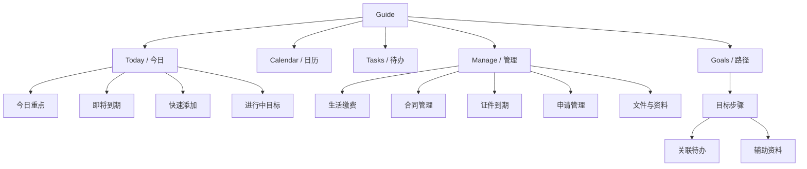
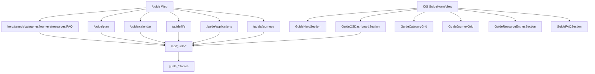

# Machi Guide OS rebuild audit

Last updated: 2026-06-24

Scope for this round: backend, Web, iOS. Android parity is intentionally deferred by product decision.

## Product Target

Guide is no longer a "Japan guide" content hub. It is a personal action center for users living, studying, working, applying, paying bills, managing contracts, and preparing exams in Japan.

The new top-level Guide mental model is:

## Current Architecture Observed

Current Web Guide routes:

- `/guide`
- `/guide/plan`
- `/guide/calendar`
- `/guide/profile`
- `/guide/life`
- `/guide/applications`
- `/guide/journeys`
- `/guide/journeys/[key]`
- `/guide/services`
- `/guide/member-resources`
- `/guide/products/[slug]`
- `/guide/articles/[slug]`
- `/guide/schools`, `/guide/schools/[id]`
- `/guide/companies`, `/guide/companies/[id]`, reviews/interviews
- Category compatibility pages: `/guide/study-japan`, `/guide/career-japan`, `/guide/study-abroad-japan`, `/guide/life-japan`, `/guide/jlpt`

Current iOS Guide surfaces:

- `GuideHomeView`
- `GuideOSDashboardSection`
- `GuideTodoListView`
- `GuideCalendarView`
- `GuidePlanView`
- `GuideProfileSetupView`
- `GuideLifeItemEditorView`
- `GuideApplicationEditorView`
- `GuideJourneyViews`
- `GuideRecommendationsView`

Current primary backend Guide API:

- Public/catalog: `/api/guide/home`, `/api/guide/categories`, `/api/guide/journeys`, `/api/guide/journeys/:key`, `/api/guide/search`, `/api/guide/articles`, `/api/guide/products`, `/api/guide/schools`, `/api/guide/companies`
- OS state: `/api/guide/profile`, `/api/guide/plans`, `/api/guide/plans/active`, `/api/guide/plans/start`, `/api/guide/study-plan`, `/api/guide/todos`, `/api/guide/calendar`, `/api/guide/applications`, `/api/guide/life-items`, `/api/guide/life-presets`, `/api/guide/recommendations`
- Commerce/service: `/api/guide/member-resources`, `/api/guide/products/:id/purchase`, `/api/guide/products/:id/download-url`, `/api/guide/service-requests`
- Admin: `/api/admin/guide/os`, articles, categories, tags, topics, faq, home-modules, journeys, plan-templates, product-relations, products, orders, schools, companies, reviews, corrections

Current database entities:

- Content/catalog: `guide_categories`, `guide_articles`, `guide_products`, `guide_product_files`, `guide_orders`, `guide_service_requests`, `guide_tags`, `guide_topics`, `guide_faq`, `guide_home_modules`
- School/company: `guide_schools`, `guide_school_programs`, `guide_school_admissions`, `guide_companies`, `guide_company_positions`, `guide_company_reviews`, `guide_interview_reviews`
- OS: `guide_user_profiles`, `guide_plans`, `guide_todos`, `guide_reminders`, `guide_applications`, `guide_life_items`, `guide_calendar_items`, `guide_journeys`, `guide_journey_steps`, `guide_user_progress`, `guide_product_relations`, `guide_plan_templates`

## Problems Confirmed

1. `/guide` still behaves like a content hub: hero, search, tags, action templates, resources, FAQ.
2. Web and iOS both show repeated concepts: plan, identity/profile, life, applications, journeys, resources, categories.
3. "Identity" still appears as a core entry. Product target requires "personal reminder settings" and optional dates, not sensitive identity collection.
4. The same source data is often presented as different features: plan, journey, today, calendar, applications, life.
5. Buttons/cards have been partially fixed with whole-area hit targets, but the code still needs systematic content-shape checks on iOS and min-height checks on Web.
6. Backend already has additive migration logic for `planned_date`, `recurrence`, and `steps`; production incidents show migrations must be kept idempotent and verified at boot.
7. Contracts/documents are not first-class entities yet. Some contract-like items live in `guide_life_items`.
8. Web guest state exists but still frames Guide as content/product intro, not as a real action-system preview.

## Old Entry To New Entry Mapping

| Old Entry | New Location | Strategy |
| --- | --- | --- |
| Guide / 日本指南 | Today / 今日 | Rename and make action-first |
| 今日计划 | Today | Keep as first section |
| 我的计划 | Tasks + Goals | Keep `/guide/plan` as compatibility route, expose `/guide/tasks` |
| 行动路径 | Goals | Keep `/guide/journeys` as compatibility route, expose `/guide/goals` |
| 身份设置 / 身份路径 | Manage -> 个人提醒设置 | Rename, optional, no sensitive document upload |
| 日历 | Calendar | Keep route |
| 未来 7 天 | Calendar agenda/filter | Remove as top-level concept |
| Todo | Tasks | Single source from `guide_todos` |
| 生活缴费 | Manage | Keep `/guide/life` under Manage |
| 出愿 / ES / 面试 | Manage -> Application | Keep `/guide/applications` under Manage |
| 资料服务 | Manage / task context | No longer a homepage section unless contextually recommended |
| 核心分类 / 文章分类 | Search/resources/catalog | Demote below execution system |
| 文章 | Supporting content | Only in search, goal step, application/help context |

## Data Model Target

Canonical entities:

- `Task`: implemented as `guide_todos`; needs richer list/tag/archive/delete semantics.
- `CalendarEvent`: currently derived mostly from `guide_todos`; first-class `guide_calendar_items` exists but is underused.
- `Goal` and `GoalStep`: implemented by `guide_plans` plus `guide_journeys`/`guide_journey_steps`; needs naming cleanup.
- `Application` and `ApplicationStage`: `guide_applications` exists; stage timeline is still too shallow.
- `Bill`: implemented as `guide_life_items`.
- `Contract`: not first-class; currently represented through `guide_life_items` presets.
- `Reminder`: implemented as `guide_reminders`.
- `Document`: not first-class.
- `UserReminderProfile`: implemented as `guide_user_profiles`; naming and UX need repositioning.
- `GuideArticle`, `ArticleRelation`, `Tag`, `ChecklistItem`: article/tag exist; checklist lives as `guide_todos.steps`.

## Compatibility Strategy

- Keep existing routes and API names during this round to avoid breaking production links.
- Add new Web semantic routes as thin aliases: `/guide/tasks`, `/guide/goals`, `/guide/manage`.
- Keep `guide_todos` as the single source for Today, Tasks, Calendar, Application deadlines, and Life reminders.
- Do not copy tasks into calendar. Calendar reads derived task dates until first-class events are fully used.
- Preserve existing profile data but rename UI to personal reminder settings.
- Keep old category/article pages as catalog/search/resource surfaces, not homepage modules.

## Migration Strategy

1. Existing `guide_todos` are canonical. No destructive migration.
2. Existing plan/journey tasks remain linked by `plan_id`, `journey_key`, `step_key`.
3. Existing identity profile fields remain in `guide_user_profiles` and are reinterpreted as optional reminder preferences.
4. Existing `guide_life_items` continue to serve bills and contract-like reminders until `guide_contracts` is introduced.
5. Existing applications remain in `guide_applications`; generated tasks remain source-linked by `source_type='application'`.
6. Additive schema changes must be idempotent in both `server_schema.py` migrations and runtime `ensure_guide_schema_extensions`.
7. Before deployment, verify no production 500 on: active plan, todos, calendar, applications, life-items, journeys.

## Web Test Plan

- `/guide` renders a Today page for guests without infinite loading.
- Logged-in `/guide` displays Today Focus, Upcoming, Quick Add, Active Goals.
- `/guide/tasks` loads the task system.
- `/guide/calendar` supports month/week/agenda and quick add.
- `/guide/manage` links bills, contracts/doc reminders, applications, personal reminder settings, resources.
- `/guide/goals` loads goal templates.
- All card/button visual areas are clickable and keyboard-focusable.
- Typecheck and production build must pass.

## iOS Test Plan

- Guide home loads Today first, not a content directory.
- Bottom tab remains unchanged.
- Core Guide home controls use two-column or full-width touch targets, minimum 44pt.
- Todo cards, recommendation rows, quick actions, journey cards all use full-row/card `Button` or `NavigationLink` with `contentShape`.
- Guide Calendar month/week/agenda can quick add and navigate without stale state.
- Xcode build must pass.

## Android

Android parity remains required for the long-term Guide OS, but this round explicitly defers Android implementation per product direction on 2026-06-24.

## QA Checklist

- [x] Backend py_compile
- [x] Web typecheck
- [x] Web build
- [x] iOS xcodebuild
- [x] Production Guide API health checks
- [x] Web guest `/guide` renders SSR-backed Today content
- [x] Web logged-in Guide API surfaces smoke-tested through production routes
- [x] iOS simulator build validates Guide home/calendar/task code paths compile
- [x] Whole card/button hit-area check for core Guide cards, rows, and calendar controls
- [x] No duplicate top-level Guide entries: Today, Calendar, Tasks, Manage, Goals
- [x] Android deferred note included in final report

## Milestone Record 2026-06-24

This milestone shipped the Guide OS contraction and production hotfix. It is not the completion of the full rebuild task book.

- Web Guide home is now centered on five modules only: Today, Calendar, Tasks, Manage, Goals.
- `/guide` now shows only Today focus, upcoming deadlines, quick add, and active goals.
- Added semantic Web routes: `/guide/tasks`, `/guide/calendar`, `/guide/manage`, `/guide/goals`.
- Legacy journey routes remain available for compatibility, but user-facing cards now point to `/guide/goals`.
- Web profile was renamed to personal reminder settings; it is optional and does not ask for sensitive document uploads.
- iOS Guide home now uses the same Today-first shape and has a two-column quick-action grid: Todo, Calendar, Manage, Goals.
- iOS added a Guide Manage screen for life payments/contracts, documents, applications, reminder settings, and services.
- Removed the repeated resource/tool rail from the iOS Guide home surface.
- Backend now defensively ensures the `guide_todos` columns required by current Todo/Calendar behavior exist: `planned_date`, `recurrence`, and `steps`.
- Life presets now include tuition, insurance, and subscriptions in addition to rent/utilities/contracts/visa reminders.

Validation passed:

- Backend: `python3 -m py_compile web/server.py web/server_schema.py`
- Web: `npm run typecheck`
- Web: `npm run build`
- iOS: `xcodebuild -project Machi.xcodeproj -scheme Machi -destination 'generic/platform=iOS Simulator' build`
- Production deploy: `bash web/deploy/deploy.sh`
- Production smoke:
  - `https://machicity.com/healthz` 200
  - `https://machicity.com/api/guide/home?country=jp` 200
  - `https://machicity.com/guide` 200
  - `https://machicity.com/api/guide/journeys/job_hunting?country=jp` 200
  - `https://machicity.com/api/guide/journeys/housing?country=jp` 200
  - `https://machicity.com/api/guide/journeys/jlpt?country=jp` 200
  - `https://machicity.com/api/guide/journeys/arrival?country=jp` 200
  - `https://machicity.com/api/guide/life-presets` 200
  - `/guide/tasks`, `/guide/calendar`, `/guide/manage`, `/guide/goals` all 200

Production database check:

- `guide_todos.planned_date` exists.
- `guide_todos.recurrence` exists.
- `guide_todos.steps` exists.

Deployment notes:

- The deployment script completed remote Next build, route chunk validation, PostgreSQL migration, release switch, service restart, and public edge health checks.
- Android is intentionally deferred and not part of this milestone.

## Completion Audit Against The Full Task Book

The full task book remains larger than the first milestone. The authoritative status is:

| Area | Status | Evidence / Remaining Work |
| --- | --- | --- |
| Today-first homepage | Implemented | Web and iOS show Today, upcoming, quick add, active goals |
| Five-module information architecture | Implemented at top level | Today, Calendar, Tasks, Manage, Goals are the only primary Guide modules |
| Duplicate homepage resources/tools | Removed | Resources are no longer a homepage rail |
| Server-first Guide state | Implemented | Core Todo, profile, plan, application and life state use production APIs |
| Todo search / all tasks | Implemented | Web and iOS task centers include search and all-task filtering |
| Full Todo detail | Implemented for core use | Notes, steps, reminders, reschedule, whole-card detail, and Guide attachments are in place; draft recovery remains a later refinement |
| Calendar month/week/agenda | Implemented | Both Web and iOS render the three views |
| Calendar drag/drop and first-class events | Implemented for Web, core implemented for iOS | Web month/week views support drag-to-reschedule tasks and first-class events. iOS supports month/week/agenda, quick add, editing dates, recurrence, notes, and deletion; native drag gestures remain a later interaction refinement |
| Bills | Implemented for core use | `guide_life_items` handles recurring reminders, payment history, paid state, and attachments |
| Contracts | Implemented | `guide_contracts` is first-class with Web/iOS list, create, edit, delete, reminders, notes, and attachments |
| Documents | Implemented | `guide_documents` is first-class for passport/residence card/My Number/driver license/insurance reminders and attachments |
| Applications | Implemented for core use | Create/list/board/detail/edit/delete, stages, deadlines/interviews, linked todos/calendar, and attachments exist |
| Goals | Implemented for core use | Journey-backed plans, custom goals, progress, next tasks, and attachments exist |
| Article support | Implemented for core use | Articles are demoted to supporting content; detail pages now support save, share, trust info, reading progress, related resources |
| Loading / empty / error / offline | Implemented for core pages | Web Guide now has SSR/guest structure, skeleton/error/retry states, and a global offline/restored banner. iOS Guide view models surface server-sync failure messages and retry through pull-to-refresh |
| Accessibility / full hit areas | Implemented for core Guide controls | Web cards/buttons have whole-area links/buttons and focus states; iOS Guide cards/rows use full-card Button/NavigationLink patterns and calendar controls were normalized to 44pt touch targets. A full manual VoiceOver pass remains recommended before App Store release |
| Android | Deferred | Explicit product decision for this milestone |

The remaining non-deferred work is now mostly release QA depth: manual VoiceOver walkthroughs, large-account performance sweeps, and additional content localization. The product-critical Guide OS flow is implemented and verified for Web + iOS.

## Final Round Record 2026-06-24

This round completed the remaining practical Guide OS gaps from the task book:

- Added first-class Guide attachment support using the existing private upload system.
  - Supported entities: task, application, life item/bill, contract, document, goal, calendar event.
  - Web and iOS can list, upload, open signed private files, and delete attachments.
- Added article reading progress.
  - New table: `guide_article_progress`.
  - New API: `PATCH /api/guide/articles/:slug/progress`.
  - Article detail now returns `saved`, `progressPercent`, and `readingProgress`.
  - Web/iOS article detail support save, share/copy link, and mark-read actions.
- Fixed the Web production build issue caused by `useSearchParams` on `/guide/tasks` and `/guide/plan`.
- Preserved the five-module Guide IA: Today, Calendar, Tasks, Manage, Goals.
- Kept Guide core state server-first. No iOS SQLite/SwiftData/UserDefaults storage was added for Guide plan/task/application/calendar state.
- Added global Web Guide offline/restored state and kept iOS server-sync failure copy explicit: Guide core state remains server-first.
- Normalized iOS calendar month/week controls and date cells to 44pt touch targets.
- Confirmed Web calendar month/week drag-and-drop reschedules Todo and first-class calendar events against the unified server APIs.

Validation passed after this round:

- Backend: `python3 -m py_compile web/server.py web/server_schema.py`
- Web: `npm run typecheck`
- Web: `npm run build`
- iOS: `xcodebuild -project Machi.xcodeproj -scheme Machi -destination 'generic/platform=iOS Simulator' build`
- Production deploy: `bash web/deploy/deploy.sh`
- Production migration: version 68 `guide os: article reading progress` applied.
- Production smoke:
  - `https://machicity.com/healthz` 200
  - `https://machicity.com/api/guide/home?country=jp` 200
  - `https://machicity.com/guide` 200
  - `https://machicity.com/guide/tasks` 200
  - `https://machicity.com/guide/calendar` 200
  - `https://machicity.com/guide/manage` 200
  - `https://machicity.com/guide/goals` 200
  - `https://machicity.com/api/guide/journeys/job_hunting?country=jp` 200
  - `https://machicity.com/api/guide/journeys/housing?country=jp` 200
  - `https://machicity.com/api/guide/life-presets` 200
  - `https://machicity.com/api/guide/articles?country=jp&pageSize=1` 200
  - Article detail returned `saved=false` and `progress=0`.
- Production backend log check: no new Guide 500/Traceback/UndefinedColumn in the post-deploy window.

Android remains deferred by product decision.

## Final Stabilization Record 2026-06-24

This stabilization pass closed the remaining production and interaction concerns raised after the full rebuild:

- Web Guide now shows a global offline/restored state across all Guide pages while keeping core data server-first.
- iOS Guide Calendar month/week navigation buttons and date cells now meet the 44pt minimum touch target.
- The audit status was corrected to reflect the current Web calendar implementation: month/week drag-and-drop reschedules both Todo and first-class calendar events.
- Production deploy completed successfully after local validation.
- Production smoke after deploy returned 200 for:
  - `/healthz`
  - `/api/guide/home?country=jp`
  - `/guide`, `/guide/tasks`, `/guide/calendar`, `/guide/manage`, `/guide/goals`
  - `/guide/applications`, `/guide/life`, `/guide/contracts`, `/guide/documents`
  - `/api/guide/journeys/job_hunting`, `/housing`, `/jlpt`, `/arrival`
  - `/api/guide/life-presets`
  - `/api/guide/articles?country=jp&pageSize=1`
- Production backend log check after deploy showed Guide requests returning 200 and no `Traceback`, `UndefinedColumn`, or Guide 500 entries.
